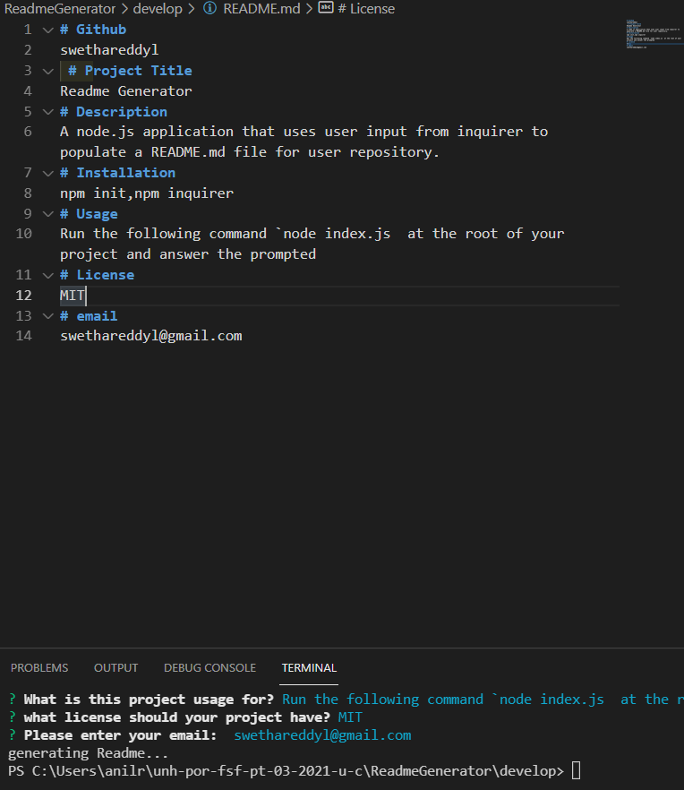

# 09 Node.js Homework: Professional README Generator

## Your Task

Task is to create a command-line application that dynamically generates a professional README.md file from a user's input using the [Inquirer package](https://www.npmjs.com/package/inquirer). Review the [Professional README Guide](https://coding-boot-camp.github.io/full-stack/github/professional-readme-guide) as a reminder of everything that a high-quality, professional README should contain. 

The application will be invoked by using the following command:

```bash
node index.js
```

Because this application won’t be deployed, need to provide a link to a walkthrough video that demonstrates its functionality. 

## User Story

As a developer, I want a README generator
so that I can quickly create a professional README for a new project


## Acceptance Criteria

Given a command-line application that accepts user input: 
1. When I am prompted for information about my application repository, a high-quality, professional README.md is generated with the title of my project and sections entitled Description, Installation, Usage, License, and email

2. When I enter my project title, then this is displayed as the title of the README

3. When I enter a description, installation instructions, usage information, license and usage,
then this information is added to the sections of the README entitled Description, Installation, Usage, License, and Email

6. When I enter my email address, then this is added to the section of the README entitled Questions, with instructions on how to reach me with additional questions

## Mock-Up

The following image shows the appearance and functionality:



## Link to the recording video


## Github link
https://swethareddyl.github.io/ReadmeGenerator/
